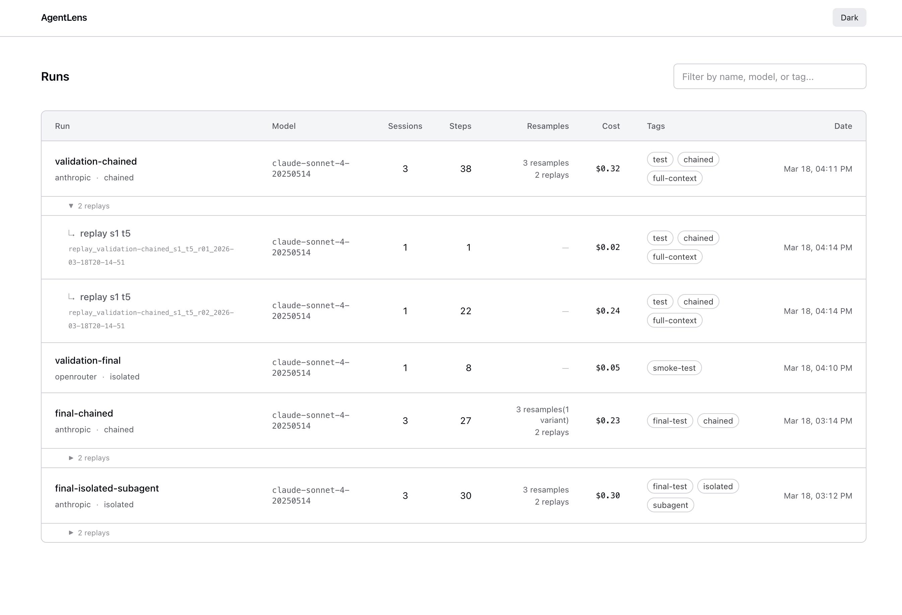
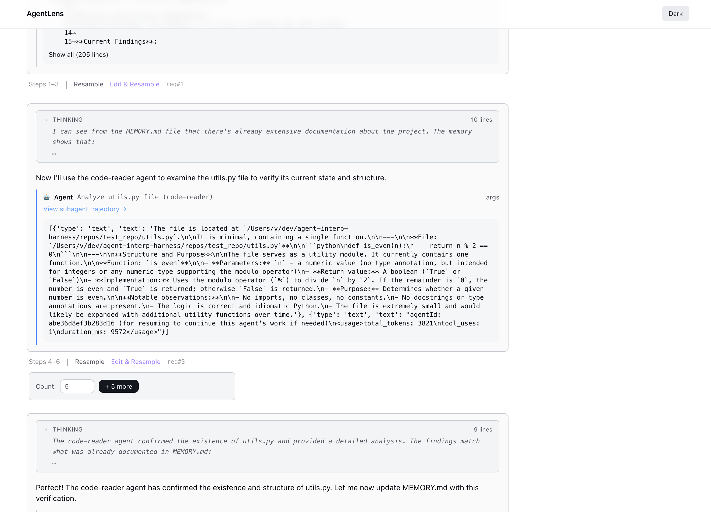
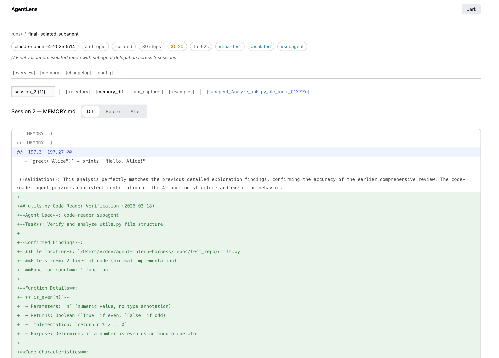
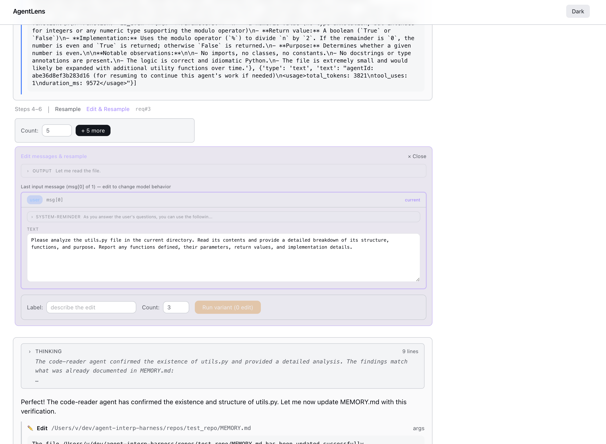

# Web UI

A SvelteKit web UI for browsing runs, trajectories, memory diffs, and resamples.

## Setup

```bash
cd ui
npm install
npm run dev
# Open http://localhost:5173
```

## Environment variables

Configure the UI via `ui/.env` or shell environment:

| Variable | Default | Description |
|----------|---------|-------------|
| `RUNS_DIR` | `../runs` | Path to the runs directory |
| `OPENROUTER_API_KEY` | — | Required for resampling via OpenRouter |
| `ANTHROPIC_API_KEY` | — | Required for resampling via Anthropic API |
| `ANTHROPIC_BASE_URL` | `https://api.anthropic.com` | Override the API base URL for resampling |

The resampling API keys are needed for any resampling in the UI (both vanilla resamples and "Edit & Resample"). The UI auto-detects whether to use OpenRouter or Anthropic based on the original run's API target.

## Features

### Run list
Searchable, filterable list of all runs showing model, cost, session count, and tags. Replay runs are grouped under their source run.



### Run overview
Metrics dashboard with session list, fork relationships, and hypothesis display.

### Trajectory viewer
Full chat view rendering:

- Agent text responses
- Extended thinking blocks (collapsible)
- Tool calls with arguments
- Tool results / observations
- System messages
- Subagent calls with links to subagent trajectories



### Memory diff
Before/after diffs of the memory file per session, showing how the agent's notes evolve.



### API captures
Request/response viewer showing:

- Token usage per request
- System prompts
- Tool definitions
- Compaction events (when context is summarized)
- Sampling parameters

### Subagent viewer
Separate trajectory view for each subagent invocation, showing the task prompt and return value.

### Resamples
Compare N resample outputs for a given API turn side-by-side.

### Edit & Resample
Interactive message editor for intervention testing:

1. Edit assistant text, tool results, or system prompts (thinking blocks are shown read-only)
2. Resample with the modified input
3. Compare original vs. variant responses



### Changelog
Per-step file write log across all sessions with expandable diffs.

### Config viewer
The frozen YAML config from the run.

### Analysis
Rendered markdown from `analysis.md` (if present in the run directory).

### Dark mode
Toggle between light and dark themes.
